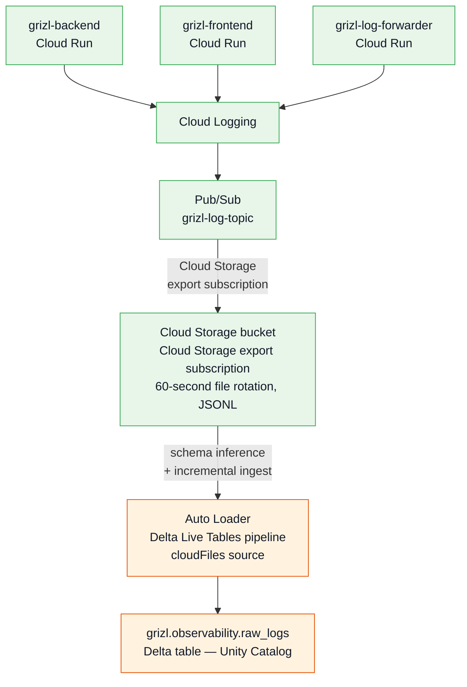
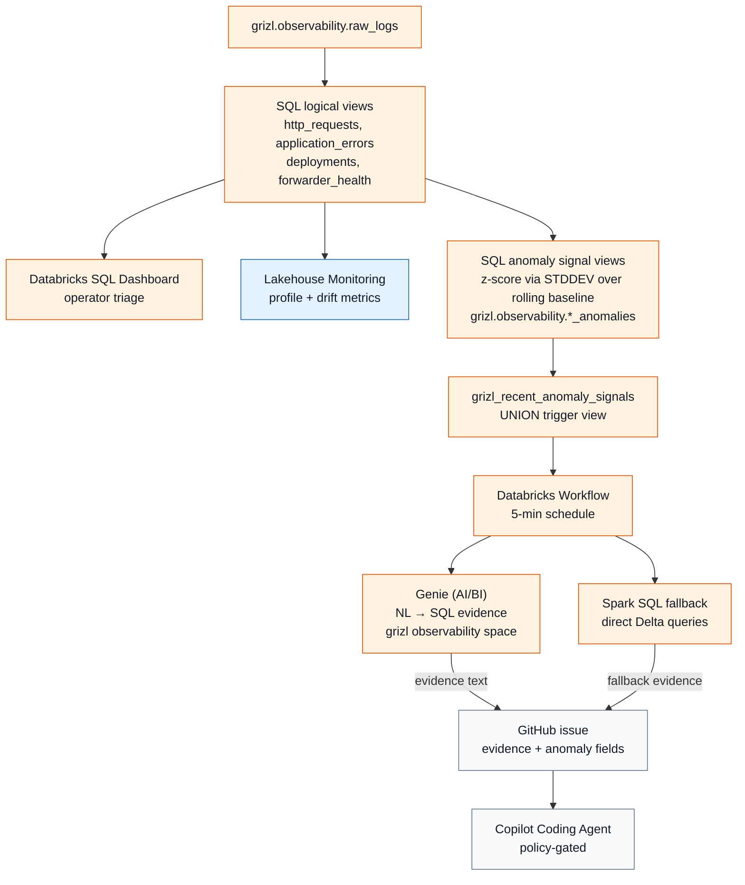

# GRIZL Databricks Observability

Public, sanitized Databricks observability package for building an agentic incident-evidence loop on top of structured application telemetry.

This repo packages the Databricks side of the GRIZL observability architecture: Pub/Sub → GCS → Auto Loader → Delta ingestion, SQL z-score anomaly views, Lakehouse Monitoring, Mosaic AI Genie for natural-language evidence retrieval, and a Databricks Workflow that creates GitHub issues — optionally assigning Copilot when remediation is scoped and code-actionable. It mirrors [grizl-fabric-observability](https://github.com/Metafiziks/grizl-fabric-observability) with the Databricks/GCP stack substituted for Microsoft Fabric/Azure.

```text
Application + frontend + deployment + forwarder telemetry
  -> Cloud Logging / Pub/Sub
  -> Cloud Storage export subscription (no forwarder changes)
  -> Auto Loader / Delta Live Tables
  -> grizl.observability.raw_logs  (Delta, Unity Catalog)
  -> SQL logical views + z-score anomaly signal views
  -> grizl_recent_anomaly_signals  (UNION trigger view)
  -> Databricks Workflow  (5-min schedule)
  -> Genie (AI/BI) evidence query  (natural-language over Delta)
  -> GitHub issue + optional Copilot Coding Agent handoff
```

| Path | Purpose |
|---|---|
| `sql/` | Unity Catalog SQL view definitions, z-score anomaly signal views, dashboard queries, SQL alert trigger queries |
| `notebooks/` | DLT Auto Loader pipeline, Lakehouse Monitoring setup, anomaly model example (MLflow), Workflow anomaly job |
| `databricks/` | Databricks Asset Bundle config, provisioning helpers, config templates, manifests, and dry-run-safe scripts |
| `docs/databricks-incident-orchestrator.md` | Reference architecture for the Workflow → Genie evidence → GitHub issue → Copilot handoff flow |

No workspace secrets, GCS credentials, Databricks tokens, or GitHub tokens are included. Replace placeholders such as `<DATABRICKS_HOST>`, `<DATABRICKS_WAREHOUSE_ID>`, `<GRIZL_GCS_LOGS_BUCKET>`, and `<DATABRICKS_CLIENT_ID>` with values from your deployment.

## Architecture

### Ingestion path — GCP → Databricks, zero changes to existing services



A single `gcloud pubsub subscriptions create ... --cloud-storage-bucket` command adds the GCS export subscription to the existing Pub/Sub topic. The existing pull subscription (used by `grizl-log-forwarder`) continues unchanged. No code changes required to any application or Cloud Run service.

### Detection, evidence, and response path



The Workflow notebook queries `grizl_recent_anomaly_signals` directly via SQL warehouse, collects evidence from Genie (with Spark SQL fallback), and creates the GitHub issue in the same execution — no external webhook required. This differs from the Fabric version where Activator calls an external incident orchestrator service.

## What is included

The SQL artifacts assume a `grizl.observability.raw_logs` Delta table populated by the DLT Auto Loader pipeline. The package provides:

**SQL logical views** (equivalent to KQL functions in the Fabric version):
- `http_requests` — HTTP request events filtered by `event_type = 'http_request'`
- `application_errors` — ERROR and CRITICAL severity events
- `frontend_telemetry` — grizl-frontend browser telemetry
- `deployments` — deployment metadata events
- `forwarder_health` — grizl-log-forwarder operational events

**SQL anomaly signal views** (z-score over rolling 2-day baseline; equivalent to KQL `series_decompose_anomalies()`):

| View | Signal |
|---|---|
| `backend_http_error_rate_anomalies` | backend 5xx/error-rate anomalies by service and route |
| `route_latency_anomalies` | route p95 latency anomalies when `duration_ms` is populated |
| `error_signature_spike_anomalies` | repeated application error-signature spikes |
| `forwarder_freshness_drop_anomalies` | drops in forwarder healthy event volume |
| `forwarder_drop_failure_anomalies` | skipped/retry/nack/failure spikes |
| `post_deployment_regression_anomalies` | post-deployment regressions by `deployment_sha` |
| `grizl_recent_anomaly_signals` | UNION of all anomaly views — the Workflow trigger query |

**Lakehouse Monitoring** (managed by Databricks; runs on schedule automatically after setup):

| Output table | Signal |
|---|---|
| `grizl.observability_monitors.raw_logs_profile` | data quality, completeness, value distributions per slice |
| `grizl.observability_monitors.raw_logs_drift_metrics` | drift in `error_rate`, `http_5xx_rate`, `p95_duration_ms` vs baseline window |

**Notebooks**:
- `01_autoloader_pipeline.py` — DLT pipeline: Pub/Sub GCS export → `raw_logs` Delta table
- `02_lakehouse_monitor_setup.py` — Unity Catalog Lakehouse Monitor with custom metrics
- `03_anomaly_model_example.py` — Isolation Forest trained on monitor profiles, registered in Unity Catalog
- `04_anomaly_signals_workflow.py` — Workflow job: queries anomaly signals via SQL warehouse, collects Genie evidence, creates GitHub issue + Copilot assignment

**Genie (AI/BI) space**:

Create via CLI:
```bash
bash databricks/scripts/genie-mgmt.sh create
```

The Genie space is pre-configured with the `grizl.observability.*` tables, sample incident questions, and instructions for interpreting anomaly scores, z-score thresholds, and deployment SHA correlations.

**Databricks Asset Bundle** (`databricks.yml`):
- DLT Auto Loader pipeline definition
- Anomaly signals Workflow job (5-min cron, paused in dev)
- All job parameters wired: `score_threshold`, `github_token`, `repo_map_json`, `genie_space_id`, `sql_warehouse_id`

## Fabric vs Databricks substitutions

| Fabric | Databricks |
|---|---|
| Fabric Eventstream → Eventhouse | Pub/Sub → Cloud Storage export → Auto Loader → Delta |
| `RawLogs` Eventhouse table | `grizl.observability.raw_logs` Delta table |
| KQL logical functions | SQL logical views (Unity Catalog) |
| `series_decompose_anomalies()` | z-score via `STDDEV`/`AVG` over `FLOOR(UNIX_TIMESTAMP/300)*300` bins |
| Fabric Activator / Reflex alert | Databricks Workflow (5-min cron) + SQL Alert (threshold trigger) |
| Fabric Data Agent (MCP) | Genie (AI/BI) — NL → SQL over Delta tables |
| KQL fallback | Spark SQL / SQL warehouse fallback |
| Entra M2M credentials | Databricks OAuth M2M (service principal) |
| External orchestrator webhook | Workflow notebook calls GitHub API directly |

## GCP setup (one-time, no service changes)

```bash
# 1. Create a GCS bucket for Pub/Sub log exports
gsutil mb -l US gs://<GRIZL_GCS_LOGS_BUCKET>

# 2. Create the Cloud Storage export subscription alongside the existing pull subscription
gcloud pubsub subscriptions create grizl-logs-gcs-export \
  --topic=grizl-log-topic \
  --cloud-storage-bucket=<GRIZL_GCS_LOGS_BUCKET> \
  --cloud-storage-file-prefix=logs/ \
  --cloud-storage-file-suffix=.jsonl \
  --cloud-storage-max-duration=60s \
  --cloud-storage-output-format=text

# 3. Grant the Databricks service principal read access
gsutil iam ch \
  serviceAccount:<DATABRICKS_SA>@<GCP_PROJECT>.iam.gserviceaccount.com:objectViewer \
  gs://<GRIZL_GCS_LOGS_BUCKET>

# Or use the helper:
npm --prefix databricks run gcs-subscription -- <BUCKET>
```

## Quick start

1. Copy the config template:

   ```bash
   cp databricks/config/grizl.databricks.env.example databricks/config/grizl.databricks.env
   ```

2. Fill in your values and run local checks:

   ```bash
   source databricks/config/grizl.databricks.env
   npm run databricks:check
   ```

3. Authenticate with the Databricks CLI:

   ```bash
   databricks auth login --host $DATABRICKS_HOST
   ```

4. Provision catalog, schema, and `raw_logs` table:

   ```bash
   npm run databricks:provision:dry-run
   npm run databricks:provision
   ```

5. Apply SQL logical views and anomaly signal views:

   ```bash
   npm run databricks:sql:observability
   npm run databricks:sql:anomaly-signals
   ```

6. Deploy the DLT pipeline and Workflow via Asset Bundle:

   ```bash
   databricks bundle deploy --target dev
   ```

7. Create the Genie space:

   ```bash
   bash databricks/scripts/genie-mgmt.sh create
   # paste the returned space_id into grizl.databricks.env as DATABRICKS_GENIE_SPACE_ID
   ```

8. Run the Lakehouse Monitoring setup notebook once in your workspace
   (`notebooks/02_lakehouse_monitor_setup.py`).

See `databricks/README.md` for provisioning details and `docs/databricks-incident-orchestrator.md` for the incident workflow.

## Anomaly detection design

The z-score anomaly views compute baselines over a 2-day rolling window using 5-minute time bins:

```sql
TIMESTAMP_SECONDS(FLOOR(UNIX_TIMESTAMP(ingest_timestamp) / 300) * 300) AS time_bin
```

A signal fires when:
- `requests >= 20` in the detection window (avoids noise on low-traffic routes)
- `baseline_stddev > 0` (requires at least two distinct baseline values)
- `(actual - baseline_mean) / baseline_stddev >= score_threshold` (default: 1.5)

This is the same conceptual approach as KQL `series_decompose_anomalies()` without requiring a time-series ML model — just aggregate SQL that any engineer can read and modify at 2 AM.

## What is intentionally excluded

- No live workspace IDs, GCS bucket names, Pub/Sub topic names, or project IDs.
- No Databricks tokens, service-principal secrets, GCS credentials, or GitHub tokens.
- No ornamental MLflow model pipeline. The `03_anomaly_model_example.py` notebook is a documented example; the production anomaly layer uses SQL views because those are auditable, editable, and do not require a model registry.
- No external webhook service. The Workflow notebook calls the GitHub API directly using a token passed as a job parameter, keeping the incident path entirely within the Databricks execution environment.

## Security notes

- Do not commit `databricks/config/grizl.databricks.env`.
- Do not commit Databricks tokens, service-principal secrets, or GCS credentials.
- Keep `DATABRICKS_CLIENT_SECRET` and `GITHUB_TOKEN` in GCP Secret Manager.
- `databricks/scripts/check.sh` scans for credential material as a local guardrail.
- The Databricks service principal needs `USE CATALOG`, `USE SCHEMA`, `SELECT`, and `MODIFY` on `grizl.observability` — not workspace-admin.
- GitHub token is passed as a Workflow job parameter — it is visible in the Workflow run details. Scope it to `issues:write` on the target repos only.
